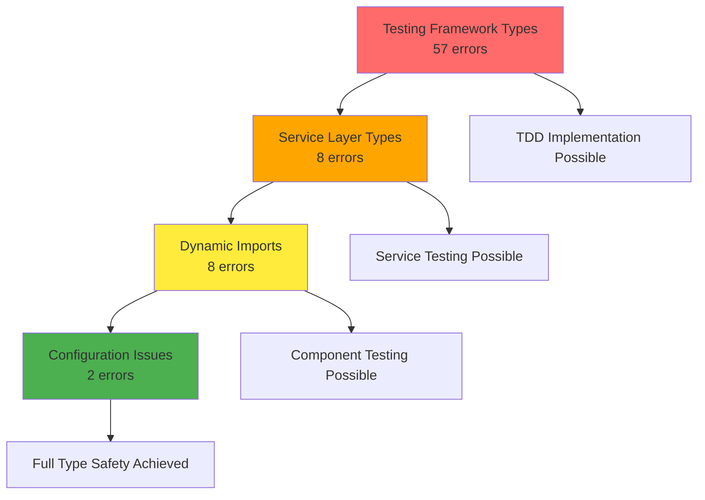

# TypeScript Error Dependencies and Resolution Priority Matrix

> Analysis Date: 2025-07-26
> Based on: 75 TypeScript compilation errors across 8 files

## Dependency Mapping

### Dependency Relationships



### Critical Path Analysis

**Blocking Dependencies:**

1. **Testing Framework** → All other categories
   - Cannot implement TDD without functional test utilities
   - Cannot validate fixes without reliable test infrastructure
   - Prevents parallel development and validation

2. **Service Layer Types** → Dynamic Imports
   - Service layer provides types used in dynamic component loading
   - Error handling interfaces required for import error management

3. **Dynamic Imports** → Configuration
   - Module resolution must work before environment configuration
   - Component loading affects theme and environment setup

## Resolution Priority Matrix

### Priority Level 1: CRITICAL (Testing Framework)

**Files**: `api-test-utils.ts`, `test-patterns.ts`
**Error Count**: 57 (76% of total)
**Estimated Effort**: 16-20 hours
**Business Impact**: HIGH

| Error Type                   | Count | Complexity | Risk   | Dependencies    |
| ---------------------------- | ----- | ---------- | ------ | --------------- |
| NextAPI Mock Incompatibility | 15    | High       | Medium | None            |
| Unknown Type Assertions      | 18    | Medium     | Low    | Mock types      |
| Type Coercion Issues         | 12    | Medium     | Medium | NextAPI types   |
| Spread Type Operations       | 4     | Low        | Low    | Object types    |
| Method Parameter Mismatches  | 8     | Medium     | Low    | Framework types |

**Resolution Approach:**

1. **Week 1, Days 1-2**: Create proper mock type definitions
2. **Week 1, Days 3-4**: Implement type assertions and guards
3. **Week 1, Days 5**: Validate all test utilities functional

**Success Criteria:**

- [ ] All test files compile without errors
- [ ] Mock functions properly typed
- [ ] Test execution successful
- [ ] No runtime errors in test environment

### Priority Level 2: HIGH (Service Layer Types)

**Files**: `assetManager.ts`, `copyGenerator.ts`, `motivationGenerator.ts`, `reviewSystem.ts`
**Error Count**: 8 (10.7% of total)
**Estimated Effort**: 6-8 hours
**Business Impact**: MEDIUM-HIGH

| Error Type                      | Count | Complexity | Risk   | Dependencies          |
| ------------------------------- | ----- | ---------- | ------ | --------------------- |
| LogContext Interface Violations | 4     | Medium     | Medium | Testing framework     |
| Promise Type Nesting            | 1     | Low        | High   | None                  |
| Any Type Index Access           | 1     | Low        | Low    | Type guards           |
| Object Property Mismatch        | 1     | Low        | Low    | Interface definitions |
| Array Type Assignment           | 1     | Low        | Low    | Union types           |

**Resolution Approach:**

1. **Week 2, Days 1-2**: Fix LogContext interface and implementations
2. **Week 2, Days 3**: Resolve Promise type issues
3. **Week 2, Days 4**: Add proper type guards and assertions
4. **Week 2, Day 5**: Comprehensive service layer testing

**Success Criteria:**

- [ ] All service files compile without errors
- [ ] Logging functionality properly typed
- [ ] Error handling maintains type safety
- [ ] Service tests pass with proper type coverage

### Priority Level 3: MEDIUM (Dynamic Imports)

**Files**: `dynamicImports.ts`
**Error Count**: 8 (10.7% of total)
**Estimated Effort**: 4-6 hours
**Business Impact**: MEDIUM

| Error Type                     | Count | Complexity | Risk   | Dependencies          |
| ------------------------------ | ----- | ---------- | ------ | --------------------- |
| Component Type Callable Issues | 2     | High       | Medium | Service types         |
| Promise Return Type Mismatches | 3     | Medium     | Medium | Component definitions |
| Generic Type Constraints       | 1     | Medium     | Low    | Type system           |
| Module Resolution Failure      | 1     | Low        | High   | File system           |
| Loading Component Type Issues  | 1     | Low        | Low    | React types           |

**Resolution Approach:**

1. **Week 3, Days 1-2**: Fix component type callable issues
2. **Week 3, Day 3**: Resolve promise return type problems
3. **Week 3, Day 4**: Fix module resolution and generic constraints
4. **Week 3, Day 5**: Validate dynamic loading functionality

**Success Criteria:**

- [ ] All dynamic imports compile successfully
- [ ] Component lazy loading functional
- [ ] Generic type constraints properly defined
- [ ] Module resolution reliable

### Priority Level 4: LOW (Configuration)

**Files**: `setup.ts`, `theme.ts`
**Error Count**: 2 (2.7% of total)
**Estimated Effort**: 2-3 hours
**Business Impact**: LOW

| Error Type                    | Count | Complexity | Risk | Dependencies |
| ----------------------------- | ----- | ---------- | ---- | ------------ |
| Read-only Property Assignment | 1     | Low        | Low  | All others   |
| Array Type Length Mismatch    | 1     | Low        | Low  | Theme system |

**Resolution Approach:**

1. **Week 4, Day 1**: Fix environment variable handling
2. **Week 4, Day 2**: Resolve theme array type definition
3. **Week 4, Day 3**: Final validation and testing

**Success Criteria:**

- [ ] Environment configuration properly handled
- [ ] Theme system type-safe
- [ ] All configuration files compile
- [ ] No remaining TypeScript errors

## Implementation Sequence

### Phase 1: Foundation Setup (Week 1)

```
Day 1: Setup development environment and create type definitions
Day 2: Fix NextApiRequest/NextApiResponse mock compatibility
Day 3: Resolve unknown type assertions in test utilities
Day 4: Fix type coercion and method parameter issues
Day 5: Comprehensive testing framework validation
```

### Phase 2: Service Integration (Week 2)

```
Day 1: Create proper LogContext interface definition
Day 2: Fix all LogContext violations across service files
Day 3: Resolve Promise type nesting and async issues
Day 4: Add type guards and fix property mismatches
Day 5: Service layer comprehensive testing
```

### Phase 3: Component Systems (Week 3)

```
Day 1: Fix component type callable issues
Day 2: Resolve dynamic import promise type mismatches
Day 3: Fix module resolution and missing imports
Day 4: Resolve generic type constraints
Day 5: Validate component loading and lazy imports
```

### Phase 4: Configuration Finalization (Week 4)

```
Day 1: Fix environment variable read-only assignment
Day 2: Resolve theme array type length requirements
Day 3: Final comprehensive validation and testing
Day 4: Enable TypeScript strict mode
Day 5: Performance optimization and documentation
```

## Risk Assessment Matrix

### High Risk Items

1. **Testing Framework Overhaul** (57 errors)
   - **Risk**: Breaking existing test infrastructure
   - **Mitigation**: Incremental approach, backup test configurations
   - **Impact**: Could delay TDD implementation

2. **Service Layer Logging Changes** (4 LogContext errors)
   - **Risk**: Breaking error reporting and monitoring
   - **Mitigation**: Maintain backward compatibility, gradual rollout
   - **Impact**: Could affect production error tracking

### Medium Risk Items

1. **Dynamic Import System** (8 errors)
   - **Risk**: Breaking lazy loading, performance impact
   - **Mitigation**: Test with production builds, monitor bundle sizes
   - **Impact**: Could affect application loading performance

### Low Risk Items

1. **Configuration Issues** (2 errors)
   - **Risk**: Minimal functional impact
   - **Mitigation**: Simple fixes, well-contained changes
   - **Impact**: No significant functional disruption

## Success Metrics and KPIs

### Quantitative Metrics

- **Error Reduction**: 75 → 0 errors (100% resolution)
- **Build Memory**: 8GB → <4GB (50% reduction)
- **Compilation Time**: Baseline measurement → 10% improvement target
- **Type Coverage**: Establish baseline → 95%+ coverage

### Qualitative Metrics

- **Developer Experience**: IDE responsiveness and error reporting
- **Test Reliability**: Consistent test execution without type errors
- **Code Maintainability**: Improved IntelliSense and refactoring safety
- **Production Stability**: Reduced runtime errors caught at compile-time

## Implementation Checkpoints

### Checkpoint 1 (End of Week 1)

- [ ] Testing framework fully functional
- [ ] 57 errors resolved (76% of total)
- [ ] TDD approach implementable
- [ ] Comprehensive test suite execution possible

### Checkpoint 2 (End of Week 2)

- [ ] Service layer type-safe
- [ ] 8 additional errors resolved (86.7% total)
- [ ] Error handling and logging properly typed
- [ ] Service testing comprehensive

### Checkpoint 3 (End of Week 3)

- [ ] Dynamic imports functional
- [ ] 8 additional errors resolved (97.3% total)
- [ ] Component loading reliable
- [ ] Performance characteristics maintained

### Checkpoint 4 (End of Week 4)

- [ ] Zero TypeScript errors
- [ ] Strict mode enabled
- [ ] Build memory optimized
- [ ] Production-ready type safety

## Rollback Strategy

### Per-Phase Rollback Points

1. **After Testing Framework**: Restore original test utilities if needed
2. **After Service Layer**: Revert service type changes if logging breaks
3. **After Dynamic Imports**: Restore static imports if performance degrades
4. **After Configuration**: Simple revert of configuration changes

### Emergency Rollback Triggers

- Build memory exceeds 10GB
- Test suite execution time increases >50%
- Production error rate increases >20%
- Development server startup fails consistently

This comprehensive dependency analysis ensures systematic, safe resolution of all TypeScript errors while maintaining application functionality and enabling incremental progress validation.
